---
## Front matter
title: "Лабораторная работа №2"
subtitle: "Архитектура компьютера"
author: "Дургарян Аделина Ованесовна"

## Generic otions
lang: ru-RU
toc-title: "Содержание"

## Bibliography
bibliography: bib/cite.bib
csl: pandoc/csl/gost-r-7-0-5-2008-numeric.csl

## Pdf output format
toc: true # Table of contents
toc-depth: 2
lof: true # List of figures
lot: true # List of tables
fontsize: 12pt
linestretch: 1.5
papersize: a4
documentclass: scrreprt
## I18n polyglossia
polyglossia-lang:
  name: russian
  options:
	- spelling=modern
	- babelshorthands=true
polyglossia-otherlangs:
  name: english
## I18n babel
babel-lang: russian
babel-otherlangs: english
## Fonts
mainfont: IBM Plex Serif
romanfont: IBM Plex Serif
sansfont: IBM Plex Sans
monofont: IBM Plex Mono
mathfont: STIX Two Math
mainfontoptions: Ligatures=Common,Ligatures=TeX,Scale=0.94
romanfontoptions: Ligatures=Common,Ligatures=TeX,Scale=0.94
sansfontoptions: Ligatures=Common,Ligatures=TeX,Scale=MatchLowercase,Scale=0.94
monofontoptions: Scale=MatchLowercase,Scale=0.94,FakeStretch=0.9
mathfontoptions:
## Biblatex
biblatex: true
biblio-style: "gost-numeric"
biblatexoptions:
  - parentracker=true
  - backend=biber
  - hyperref=auto
  - language=auto
  - autolang=other*
  - citestyle=gost-numeric
## Pandoc-crossref LaTeX customization
figureTitle: "Рис."
tableTitle: "Таблица"
listingTitle: "Листинг"
lofTitle: "Список иллюстраций"
lotTitle: "Список таблиц"
lolTitle: "Листинги"
## Misc options
indent: true
header-includes:
  - \usepackage{indentfirst}
  - \usepackage{float} # keep figures where there are in the text
  - \floatplacement{figure}{H} # keep figures where there are in the text
---

# Цель работы

Целью работы является изучить идеологию и применение средств
контроля версий. Приобрести практические навыки по работе с
системой git.

# Задание

1. Техническое обеспечение
1) Настройка github
2) Базовая настройка git
3) Создания SSH ключа
4) Создание рабочего пространства и репозитория курса на основе
шаблона
5) Создание репозитория курса на основе шаблона
6) Настройка каталога курса
2. Задание для самостоятельной работы
В ходе выполнения лабораторной работы предстоит создать отчёт в
соответствующем каталоге рабочего пространства(labs>lab02>report)и
скопировать отчеты по выполнению предыдущих лабораторных работ
в соответствующие каталоги, а затем загрузить все файлы на GitHub.

# Теоретическое введение

Здесь описываются теоретические аспекты, связанные с выполнением работы.

Например, в табл. [-@tbl:std-dir] приведено краткое описание стандартных каталогов Unix.

: Описание некоторых каталогов файловой системы GNU Linux {#tbl:std-dir}

| Имя каталога | Описание каталога                                                                                                          |
|--------------|----------------------------------------------------------------------------------------------------------------------------|
| `/`          | Корневая директория, содержащая всю файловую                                                                               |
| `/bin `      | Основные системные утилиты, необходимые как в однопользовательском режиме, так и при обычной работе всем пользователям     |
| `/etc`       | Общесистемные конфигурационные файлы и файлы конфигурации установленных программ                                           |
| `/home`      | Содержит домашние директории пользователей, которые, в свою очередь, содержат персональные настройки и данные пользователя |
| `/media`     | Точки монтирования для сменных носителей                                                                                   |
| `/root`      | Домашняя директория пользователя  `root`                                                                                   |
| `/tmp`       | Временные файлы                                                                                                            |
| `/usr`       | Вторичная иерархия для данных пользователя                                                                                 |

Более подробно про Unix см. в [@tanenbaum_book_modern-os_ru; @robbins_book_bash_en; @zarrelli_book_mastering-bash_en; @newham_book_learning-bash_en].

# Выполнение лабораторной работы
1. Для начала создадим учётную запись на сайте https://github.com/ и заполним основные данные 

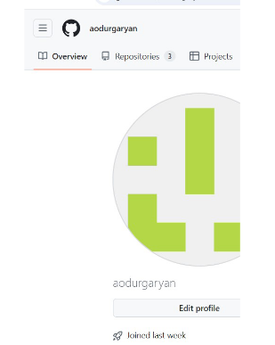{#fig:001 width=100%}

2. Сначала сделаем предварительную конфигурацию git, указав имя и email владельца репозитория

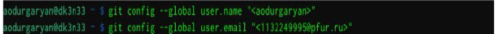{#fig:001 width=100%}

3. Настроим utf-8 в выводе сообщений git, зададим имя начальной ветке (будем называть её master), укажем значение параметров autocrlf и safecrlf

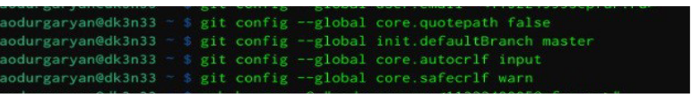{#fig:001 width=100%}

4. Для последующей идентификации пользователя на сервере репозиториев сгенерируем пару ключей (приватный и открытый) 

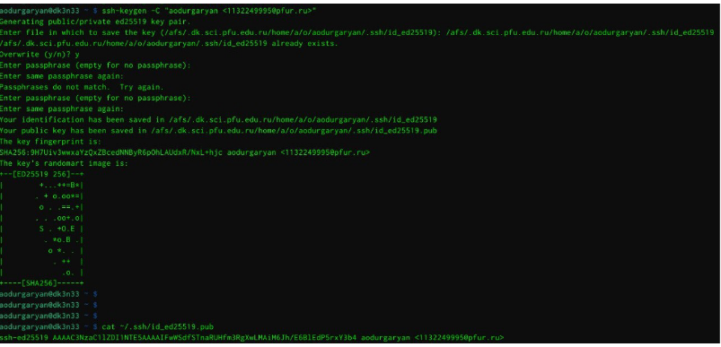{#fig:001 width=100%}

5. Далее загрузим сгенерированный открытый ключ на Github, предварительно скопировав его в буфер обмена 

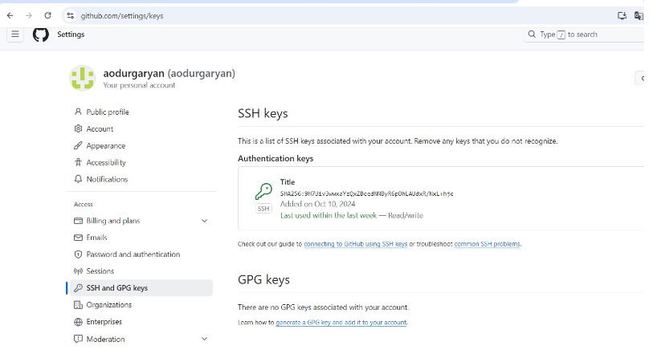{#fig:001 width=100%}

6. Создадим каталог для предмета «Архитектура компьютера» для последующего создания рабочего пространства

 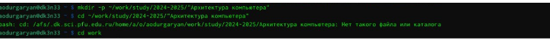{#fig:001 width=100%}

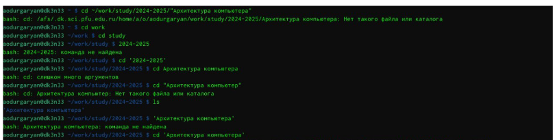{#fig:001 width=100%}

7. Через web-интерфейс github создадим репозиторий на основе шаблона, указав имя study_2024–2025_arh-рс 

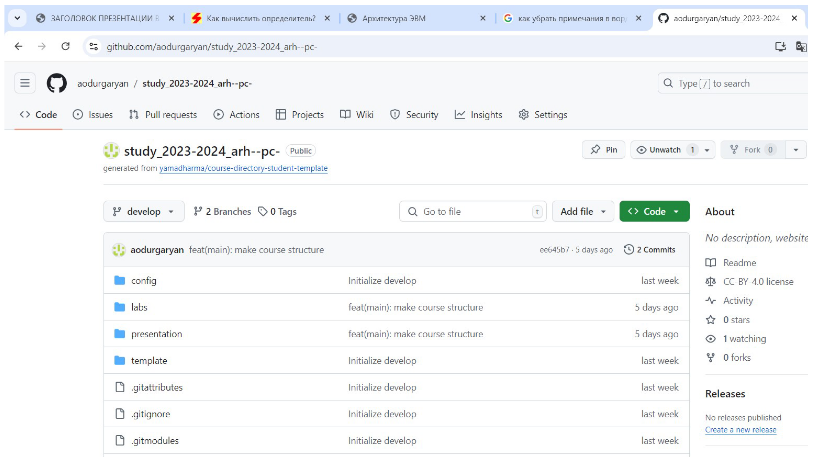{#fig:001 width=100%}

8. Перейдем в каталог курса и скопируем в него созданный репозиторий с помощью ссылки для клонирования

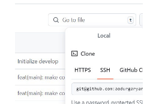{#fig:001 width=100%}

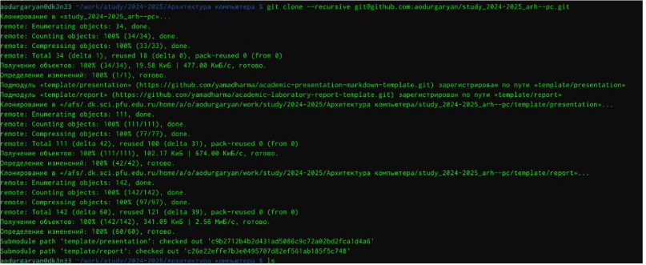{#fig:001 width=100%}

9. Далее перейдем в каталог, удалим лишние файлы 

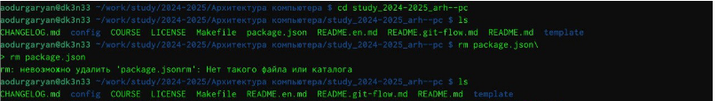{#fig:001 width=100%}

10. Далее создаем необходимые каталоги

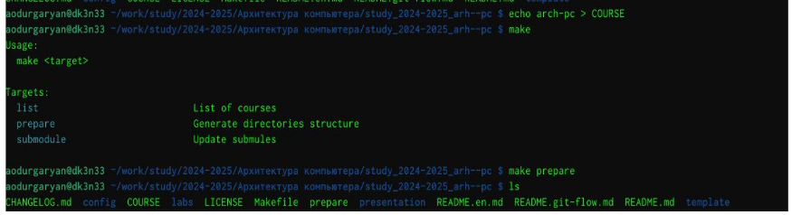{#fig:001 width=100%}

11. Далее отправляем файлы на сервере 

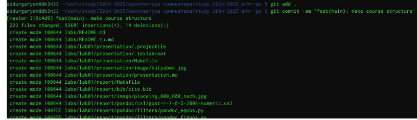{#fig:001 width=100%}

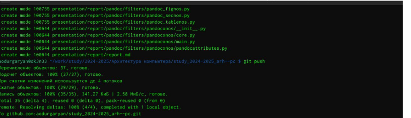{#fig:001 width=100%}

12. Проверим правильность создания иерархии рабочего пространства в локальном репозитории

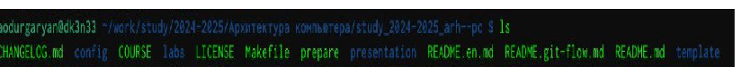{#fig:001 width=100%}

13.  Далее выполним задания для самостоятельной работы. Сначала с помощью команды cd входим в labs и lab01 отчет по выполнению лабораторной работы в соответствующем каталоге рабочего пространства (labs>lab02>report) затем пересоним отчет на сайт

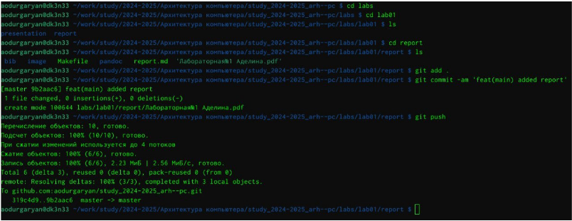{#fig:001 width=100%}

# Выводы

Выполнив данную лабораторную работу я обрела теоретические и
практические знания в использовании Linux и github. При помощи консоли я
научилась проводить стандартные процедуры при наличии центрального
репозитория, настраивать github, создания SSH ключа, сохранение и отправка
изменений на локальном репозитории.

# Список литературы{.unnumbered}

::: {#refs}
:::
