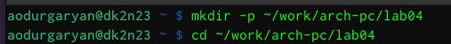
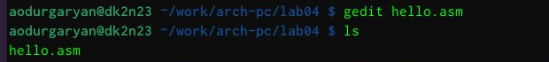
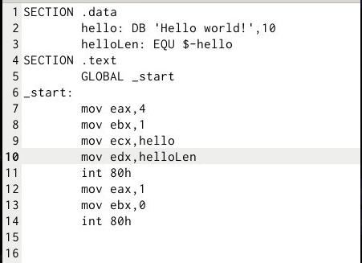
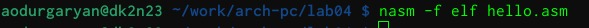
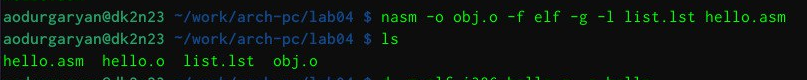
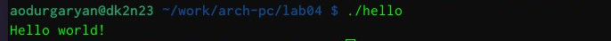
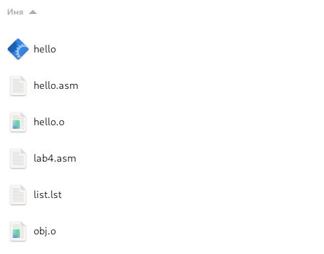
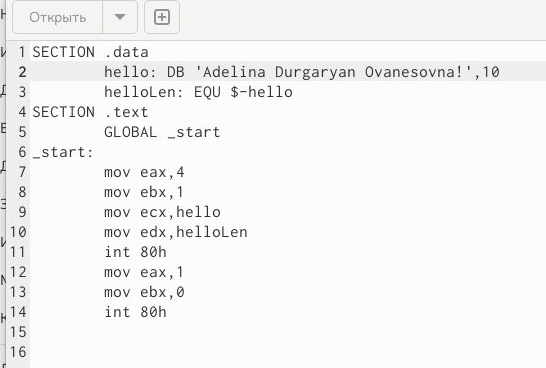
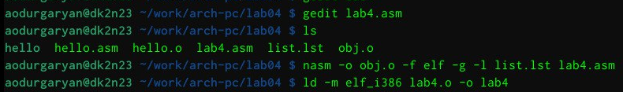
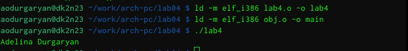

---
## Front matter
title: "Лабораторная работа №4"
subtitle: "Архитектура компьютера"
author: "Дургарян Аделина Ованесовна"

## Generic otions
lang: ru-RU
toc-title: "Содержание"

## Bibliography
bibliography: bib/cite.bib
csl: pandoc/csl/gost-r-7-0-5-2008-numeric.csl

## Pdf output format
toc: true # Table of contents
toc-depth: 2
lof: true # List of figures
lot: true # List of tables
fontsize: 12pt
linestretch: 1.5
papersize: a4
documentclass: scrreprt
## I18n polyglossia
polyglossia-lang:
  name: russian
  options:
	- spelling=modern
	- babelshorthands=true
polyglossia-otherlangs:
  name: english
## I18n babel
babel-lang: russian
babel-otherlangs: english
## Fonts
mainfont: IBM Plex Serif
romanfont: IBM Plex Serif
sansfont: IBM Plex Sans
monofont: IBM Plex Mono
mathfont: STIX Two Math
mainfontoptions: Ligatures=Common,Ligatures=TeX,Scale=0.94
romanfontoptions: Ligatures=Common,Ligatures=TeX,Scale=0.94
sansfontoptions: Ligatures=Common,Ligatures=TeX,Scale=MatchLowercase,Scale=0.94
monofontoptions: Scale=MatchLowercase,Scale=0.94,FakeStretch=0.9
mathfontoptions:
## Biblatex
biblatex: true
biblio-style: "gost-numeric"
biblatexoptions:
  - parentracker=true
  - backend=biber
  - hyperref=auto
  - language=auto
  - autolang=other*
  - citestyle=gost-numeric
## Pandoc-crossref LaTeX customization
figureTitle: "Рис."
tableTitle: "Таблица"
listingTitle: "Листинг"
lofTitle: "Список иллюстраций"
lotTitle: "Список таблиц"
lolTitle: "Листинги"
## Misc options
indent: true
header-includes:
  - \usepackage{indentfirst}
  - \usepackage{float} # keep figures where there are in the text
  - \floatplacement{figure}{H} # keep figures where there are in the text
---

# Цель работы

Освоить процедуры компиляции и сборки программ, написанных на ассемблере NASM.

# Задание

1. Отчёт по выполнению лабораторной работы оформляется в формате Markdown. В качестве
отчёта необходимо предоставить отчёты в 3 форматах: pdf, docx и md. А также файлы с
исходными текстами написанных при выполнении лабораторной работы программ (файлы
*.asm). 
2. Файлы необходимо загрузить на странице курса в ТУИС в задание к соответствующей
лабораторной работе и загрузить на Github.

# Теоретическое введение

Здесь описываются теоретические аспекты, связанные с выполнением работы.

Например, в табл. [-@tbl:std-dir] приведено краткое описание стандартных каталогов Unix.

: Описание некоторых каталогов файловой системы GNU Linux {#tbl:std-dir}

| Имя каталога | Описание каталога                                                                                                          |
|--------------|----------------------------------------------------------------------------------------------------------------------------|
| `/`          | Корневая директория, содержащая всю файловую                                                                               |
| `/bin `      | Основные системные утилиты, необходимые как в однопользовательском режиме, так и при обычной работе всем пользователям     |
| `/etc`       | Общесистемные конфигурационные файлы и файлы конфигурации установленных программ                                           |
| `/home`      | Содержит домашние директории пользователей, которые, в свою очередь, содержат персональные настройки и данные пользователя |
| `/media`     | Точки монтирования для сменных носителей                                                                                   |
| `/root`      | Домашняя директория пользователя  `root`                                                                                   |
| `/tmp`       | Временные файлы                                                                                                            |
| `/usr`       | Вторичная иерархия для данных пользователя                                                                                 |

Более подробно про Unix см. в [@tanenbaum_book_modern-os_ru; @robbins_book_bash_en; @zarrelli_book_mastering-bash_en; @newham_book_learning-bash_en].

# Выполнение лабораторной работы

1. Создаю каталог для работы с программами на языке ассемблера NASM и перехожу в созданный каталог:

{#fig:001 width=100%}

2. Создаю текстовый файл с именем hello.asm:

{#fig:001 width=100%}

3. Открываю этот файл с помощью текстового редактора gedit:

{#fig:001 width=100%}

4. Ввожу в файл следующий текст:

{#fig:001 width=100%}

5. Для компиляции приведённого выше текста программы «Hello World» пишу nasm -f elf hello.asm и с помощью команды ls проверяю, что объектный файл был создан:

{#fig:001 width=100%}

6. Ввожу команду nasm -o obj.o -f elf -g -l list.lst hello.asm , которая скомпилирует исходный файл hello.asm в obj.o ,при этом формат выходного файла
будет elf, и в него будут включены символы для отладки (опция -g), кроме того, будет создан файл листинга list.lst (опция -l). С помощью команды ls проверяю, что файлы были созданы:

{#fig:001 width=100%}

7. Передаю на обработку компоновщику:

{#fig:001 width=100%}

8. Запускаю на выполнение созданный исполняемый файл, находящийся в текущем каталоге

{#fig:001 width=100%}

9. Создадим копию файла hello.asm с именем lab4.asm

{#fig:001 width=100%}

10. Внесём изменения в текст программы в файле lab5.asm

{#fig:001 width=100%}

11. Оттранслируем полученный текст программы lab4.asm в объектный файл. Выполним компоновку объектного файла и запустим получившийся исполняемый файл.

{#fig:001 width=100%}

{#fig:001 width=100%}

# Выводы

В ходе выполнения работы, я освоила процедуры компиляции и сборки программ, написанных на ассемблере NASM.

